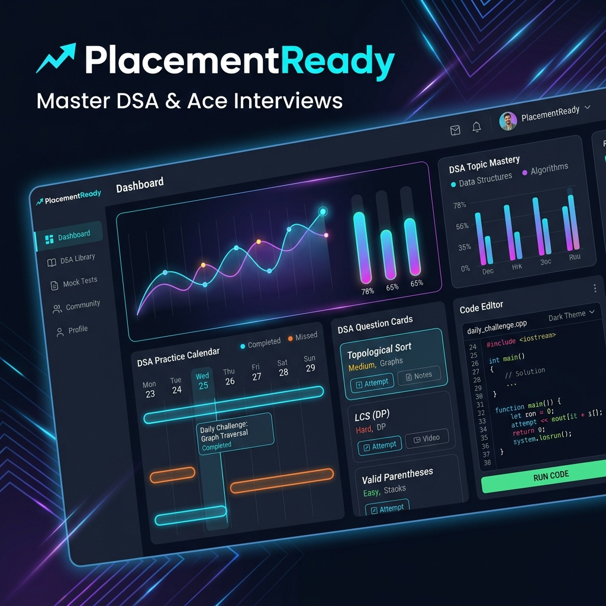

# PlacementReady – DSA & Interview Preparation Platform

Welcome to **PlacementReady**, a comprehensive, multi-application ecosystem designed to empower students with DSA (Data Structures & Algorithms) mastery and mock interview preparation, while equipping administrators with powerful control and analytics dashboards.

This project is built using a modern tech stack (Next.js 15, React 19, Firebase, Tailwind CSS v4, and Shadcn UI) to provide a lightning-fast, high-fidelity experience.

---

## 📱 The Multi-App Architecture

PlacementReady consists of two fully-featured, decoupled Next.js web applications sharing a unified database model:

### 🎓 1. Student Portal (`/user-app`)
A feature-rich platform tailored specifically for students to prepare, learn, and excel in recruitment processes.

- **📊 Comprehensive Student Dashboard**: Real-time progress trackers, daily streaks, visual completion statistics, and customized roadmap suggestions.
- **💻 Interactive DSA Platform**: Curated lists of Data Structures & Algorithms questions grouped by difficulty (Easy, Medium, Hard) and topics.
- **📝 Company-Specific Prep**: Specialized preparation kits tailored for top-tier tech companies (e.g., FAANG/MAANG) with recent interview trends.
- **🎓 Courses & Projects Hub**: Step-by-step programming courses and interactive project ideas to build an outstanding, recruiter-ready resume.
- **💼 Internship Tracker**: Portal to search, view, and track application status for upcoming career opportunities.
- **📚 Rich Learning Resources**: Detailed DSA articles, syntax notes, and quick cheat sheets for last-minute revision.

---

### 🔑 2. Administration Dashboard (`/admin-app`)
A secure, powerful command center designed for moderators and educators to manage platform content and monitor student success.

- **👥 User & Analytics Administration**: Search, filter, and view registered student profiles, track individual student performance, and view platform metrics.
- **📂 Unified Content Management System (CMS)**:
  - **Questions Manager**: Add, edit, and categorize DSA coding challenges.
  - **Mock Tests Portal**: Design, configure, and publish real-time mock tests.
  - **Course & Projects Editor**: Control tutorials and curated projects instantly.
  - **Resources Manager**: Write and publish articles, notes, and company prep sheets using clean interfaces.

---

## 🛠️ Technology Stack

PlacementReady leverages state-of-the-art tools and frameworks to ensure reliability, scalability, and premium performance:

- **Frontend & Routing**: [Next.js 15](https://nextjs.org/) (App Router Architecture, React 19)
- **Programming Language**: [TypeScript](https://www.typescriptlang.org/) (Robust typing & safety)
- **Styling & Design System**: [Tailwind CSS v4](https://tailwindcss.com/) & [Shadcn UI](https://ui.shadcn.com/) (For a dark-themed, glassmorphic, responsive interface)
- **Animations**: [Framer Motion](https://www.framer.com/motion/) (Smooth visual transitions & interactive micro-interactions)
- **Backend & Database**: [Firebase Suite](https://firebase.google.com/) (Firestore Realtime Database & Firebase Authentication with Google Auth)
